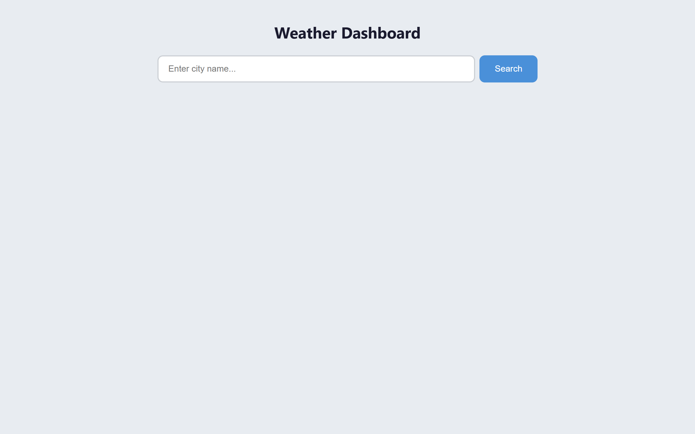
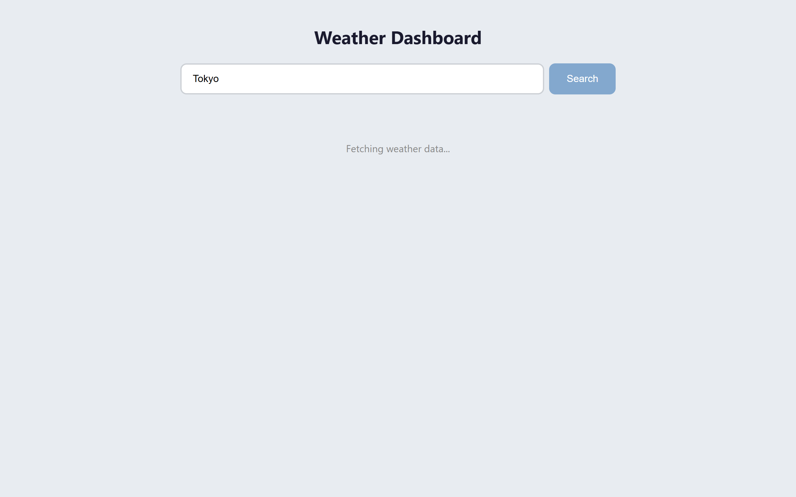
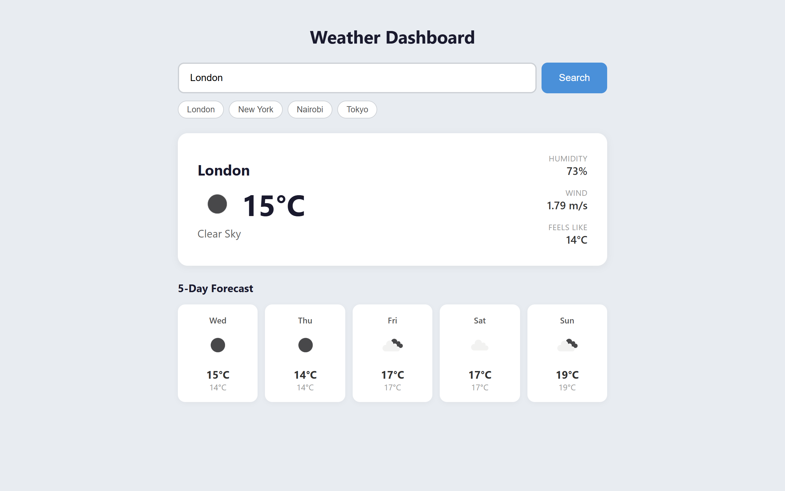
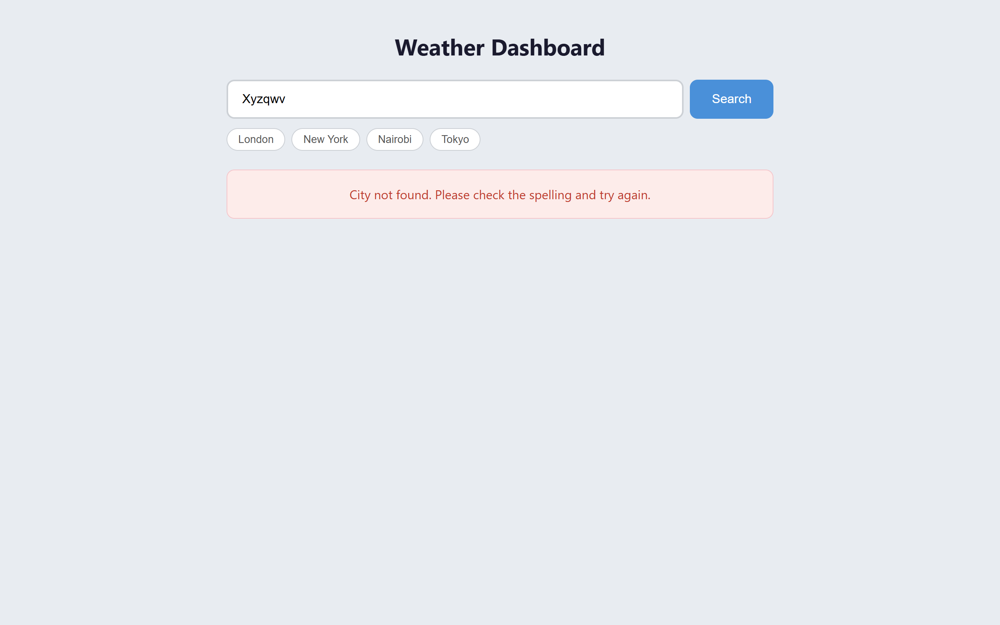
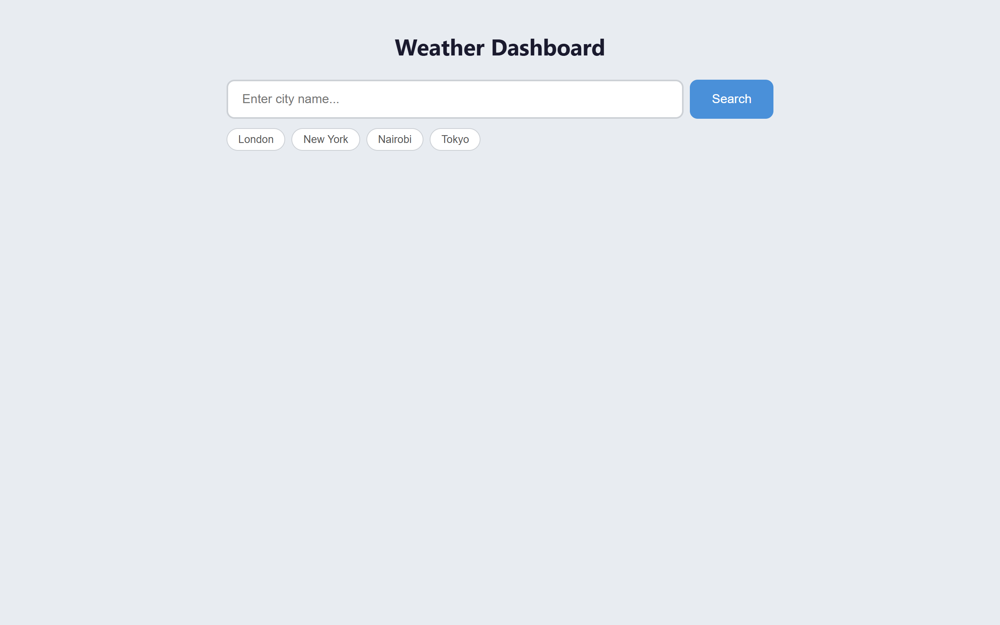
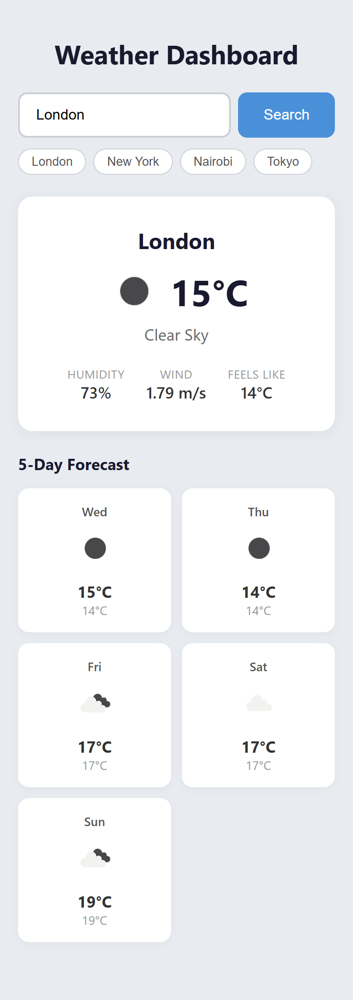

# Weather Dashboard

A single-page weather app built with plain HTML, CSS and JavaScript. Type a city name and it shows the current conditions plus a 5-day forecast, using the [OpenWeatherMap](https://openweathermap.org/) API. Recent searches are kept in `localStorage` so they survive a page reload.

## Features

- **Current weather** – temperature, condition icon and description, humidity, wind speed and "feels like" temperature.
- **5-day forecast** – one card per day with the day name, icon, high and low.
- **Search history** – the last 5 searched cities are shown as clickable chips under the search bar and persist between visits.
- **Loading and error states** – a loading message while fetching, and clear messages for "city not found", network failures and other API errors.
- **Keyboard friendly** – press <kbd>Enter</kbd> in the input to search.
- **Responsive layout** – the details and forecast cards reflow on narrow screens.

## Screenshots

| Initial state | Loading |
| --- | --- |
|  |  |

**Current weather and 5-day forecast**



| City not found | Search history persisted after reload |
| --- | --- |
|  |  |

**Mobile layout**



## Getting started

### 1. Get an OpenWeatherMap API key

1. Create a free account at <https://home.openweathermap.org/users/sign_up>.
2. Open the **API keys** tab in your account and copy the default key (or generate a new one).
3. New keys can take a couple of hours to activate. Until then requests return `401`.

### 2. Add the key to the project

Open `script.js` and replace the value of `API_KEY` at the top of the file:

```js
const API_KEY = 'your_api_key_here';
```

### 3. Run the app

There is no build step or dependency to install. Either:

- **Open the file directly** – double-click `index.html` (or drag it into a browser), or
- **Serve it locally** (recommended, matches how it will be hosted):

  ```bash
  # Python 3
  python -m http.server 8000

  # or Node
  npx serve .
  ```

  Then visit <http://localhost:8000>.

### 4. Try it out

Type a city such as `London`, `Nairobi` or `New York` and press **Search** or <kbd>Enter</kbd>. Click any chip in the history row to search that city again.

## Project structure

```
weather_dashboard/
├── index.html      # Page markup: search bar, history, loading/error panels, weather layout
├── styles.css      # Styling and responsive rules
├── script.js       # API calls, DOM updates, history persistence
├── screenshots/    # Images used in this README
└── README.md
```

## How it works

- `searchWeather(city)` shows the loading state, disables the button, then calls the `/weather` and `/forecast` endpoints with `units=metric`.
- A `404` from the API is mapped to "City not found", a `TypeError` from `fetch` to a connectivity message, and anything else to a generic error.
- `filterDailyForecast()` reduces the 3-hourly forecast list to the first entry of each calendar day and keeps five days.
- `saveToHistory()` de-duplicates case-insensitively, puts the newest city first, trims to 5 entries and stores the array under the `weather-history` key in `localStorage`.
- Weather icons are loaded from `https://openweathermap.org/img/wn/{icon}@2x.png`.

## Tech

- HTML5, CSS3 (Flexbox and Grid), vanilla JavaScript (ES2017 `async`/`await`)
- OpenWeatherMap Current Weather and 5 Day / 3 Hour Forecast APIs
- No frameworks, bundlers or packages

