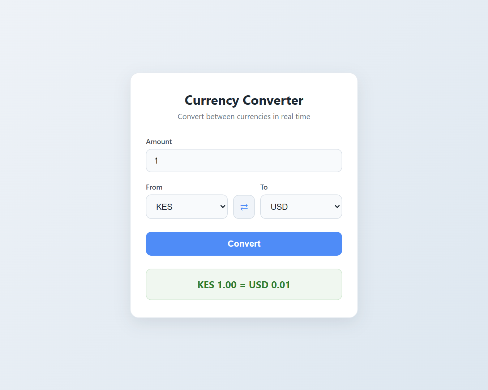
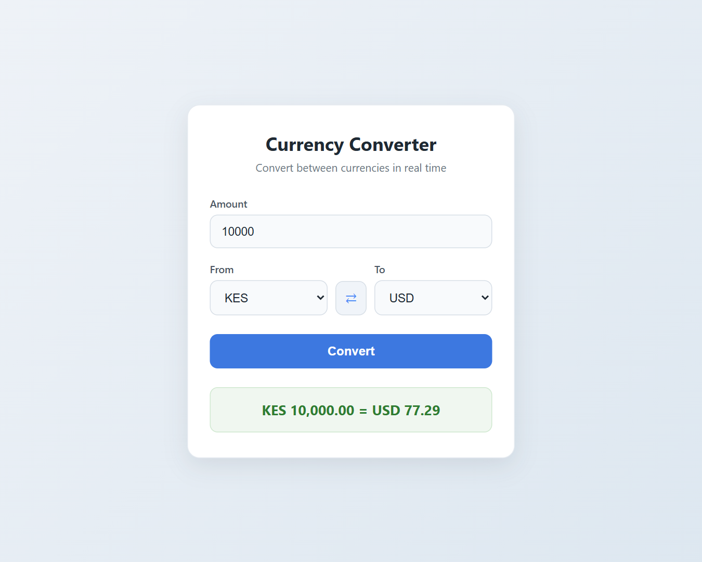
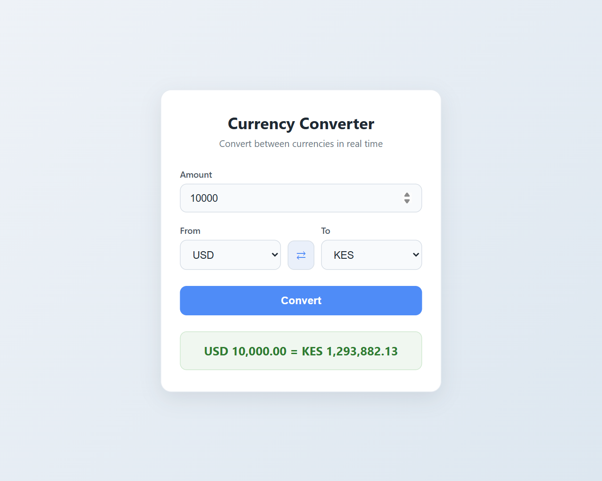
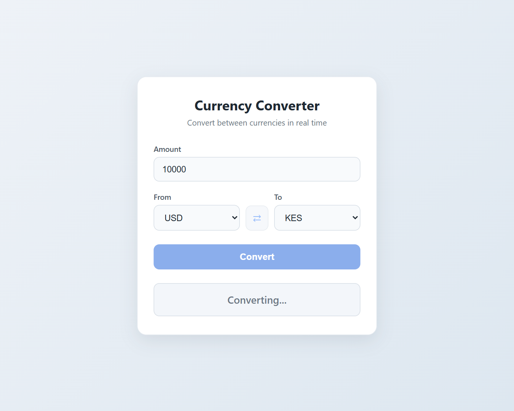
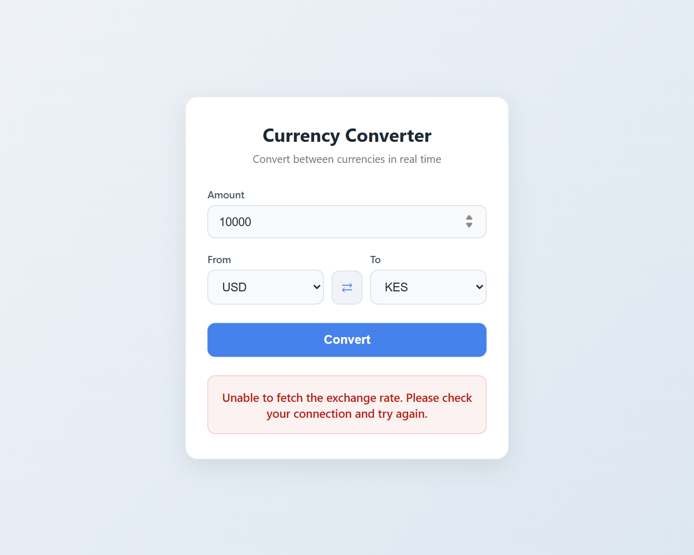
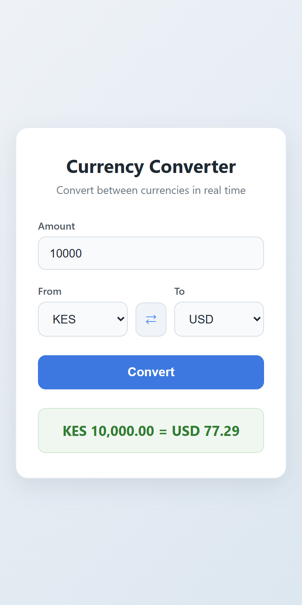

# 💱 Currency Converter

A lightweight, dependency-free currency converter for East African and major world currencies. Enter an amount, pick a From and To currency, and the app fetches the live exchange rate from the [Open Exchange Rate API](https://www.exchangerate-api.com/docs/free) and shows the converted value with a one-click swap, loading state, and friendly error messages.


---

## Table of Contents

- [Screenshots](#screenshots)
- [Features](#features)
- [Tech Stack](#tech-stack)
- [Project Structure](#project-structure)
- [Getting Started](#getting-started)
- [Configuration](#configuration)
- [How It Works](#how-it-works)
- [Error Handling](#error-handling)
- [Deployment](#deployment)
- [Known Limitations](#known-limitations)
- [Acknowledgements](#acknowledgements)
- [Author](#author)
- [License](#license)

---

## Screenshots

### Default view

On load the app converts 1 KES to USD so the card is never empty.



### Conversion result

Entering 10,000 and clicking Convert shows the live result in the format `KES 10,000.00 = USD 77.29`.



### Swap

The ⇄ button exchanges the From and To currencies and converts again immediately.



### Loading state

While the rate is being fetched the result box turns grey, shows "Converting...", and both buttons are disabled.



### Error state

If the API cannot be reached, a red message replaces the result instead of a blank card or "NaN".



### Mobile layout

The card is fluid and fits a 390px viewport without horizontal scrolling.



---

## Features

- **Six supported currencies**: KES, USD, EUR, GBP, TZS, and UGX, defined in a static list so the dropdowns always render, even if the API is down.
- **Sensible default pair**: KES → USD on first load.
- **Amount input** with browser validation (`required`, `min="0.01"`) and a decimal keyboard on mobile via `inputmode="decimal"`.
- **Convert button** wired to the form's submit event, so clicking the button and pressing Enter behave identically.
- **Formatted result** in the form `KES 10,000.00 = USD 77.29`, with thousands separators and exactly two decimals.
- **Swap button** that exchanges the two currencies and re-runs the conversion.
- **Loading state** with "Converting..." text, a muted result box, and disabled buttons while the request is pending.
- **Graceful error handling** for network failures, non-2xx responses, API-level error results, and missing rates.
- **Input validation** that rejects empty, non-numeric, or non-positive amounts with a clear message.
- **Accessible by default**: labelled inputs, an `aria-label` on the swap button, and an `aria-live` region so screen readers announce each new result.
- **Zero dependencies**: no framework, no build step, no package manager, no API key.

---

## Tech Stack

| Layer | Technology |
| --- | --- |
| Markup | Semantic HTML5 with a native `<form>` and `<select>` elements |
| Styling | Modern CSS: Flexbox, custom focus rings, state classes for loading and error |
| Logic | Vanilla JavaScript (ES2022): `fetch`, `async/await`, `Intl` number formatting via `toLocaleString` |
| Data | [open.er-api.com](https://open.er-api.com) `v6/latest/{base}` endpoint (free, no key required) |
| Fonts | System font stack (no external font requests) |

---

## Project Structure

```
Currency-converter/
├── index.html          # Card layout, form, currency row, result box
├── styles.css          # Card styling, inputs, buttons, loading and error states
├── script.js           # Currency list, validation, fetching, formatting, event wiring
├── screenshots/        # Images used in this README
│   ├── default.png
│   ├── result.png
│   ├── swap.png
│   ├── loading-state.png
│   ├── error-state.png
│   └── mobile.png
└── README.md
```

---

## Getting Started

### Prerequisites

- A modern browser (Chrome, Edge, Firefox, or Safari released in the last two years).
- No API key is required. The open.er-api.com free endpoint updates rates once every 24 hours and has no documented request cap.
- Optional: any static file server for local development. Examples below use Node.js or Python, but neither is required.

### 1. Clone the repository

```bash
git clone https://github.com/amokim/mctaba.git
cd "mctaba/Week 3/week-3-day-3-assignment/Currency-converter"
```

### 2. Run the app

**Option A: open the file directly**

Double-click `index.html`. The API permits cross-origin requests, so the app works from a `file://` URL.

**Option B: serve it locally (recommended)**

```bash
# Node.js
npx serve .

# Python 3
python -m http.server 8000

# VS Code
# Install the "Live Server" extension, right-click index.html, choose "Open with Live Server"
```

Then visit the URL printed in your terminal, for example `http://localhost:3000` or `http://localhost:8000`.

### 3. Verify it works

1. The card loads and shows `KES 1.00 = USD 0.01` within a second.
2. Type `10000` and click **Convert**. The result updates to roughly `KES 10,000.00 = USD 77`.
3. Click **⇄**. The selects flip to USD → KES and the result becomes roughly `USD 10,000.00 = KES 1,290,000`.
4. Clear the amount and click **⇄** again. The message "Please enter an amount greater than 0." appears.
5. Open DevTools, set the Network tab to Offline, and click **Convert**. The red error message appears.

---

## Configuration

All tunable values live at the top of `script.js`.

| Constant | Default | Purpose |
| --- | --- | --- |
| `CURRENCIES` | `['KES', 'USD', 'EUR', 'GBP', 'TZS', 'UGX']` | Codes shown in both dropdowns, in this order. |
| `DEFAULT_FROM` | `'KES'` | From currency selected on first load. Must be in `CURRENCIES`. |
| `DEFAULT_TO` | `'USD'` | To currency selected on first load. Must be in `CURRENCIES`. |
| `API_BASE` | `https://open.er-api.com/v6/latest` | Endpoint prefix. The From currency code is appended as the base. |

To add a currency, append its ISO 4217 code to `CURRENCIES`. The API supports over 160 codes, and no other changes are needed.

To change the number of decimals, edit `minimumFractionDigits` and `maximumFractionDigits` inside `formatMoney`.

---

## How It Works

1. **Boot.** `populateCurrencies` builds the `<option>` elements for both selects from the static list and applies the default pair. No network call is made at this stage.
2. **Initial conversion.** `runConversion` is called once so the card shows a real rate immediately.
3. **Validate.** `readAmount` parses the input and returns `null` for empty, non-numeric, or non-positive values. When that happens a message is shown, focus returns to the field, and no request is sent.
4. **Fetch.** `convert` requests `/v6/latest/{from}`. While the promise is pending the result box shows "Converting..." and both buttons are disabled to prevent duplicate requests.
5. **Check.** The response must be `ok`, its `result` field must equal `"success"`, and `rates[to]` must be a number. Any failure throws and is turned into the error message.
6. **Format.** The amount and converted value are formatted with `toLocaleString` using two fixed decimals, then assembled as `FROM amount = TO amount`.
7. **Swap.** The swap handler exchanges the two select values and calls `runConversion`, so the result is always in sync with what the selects show.

---

## Error Handling

| Condition | What the user sees |
| --- | --- |
| Empty, non-numeric, zero, or negative amount | Please enter an amount greater than 0. |
| Offline / DNS failure / request blocked | Unable to fetch the exchange rate. Please check your connection and try again. |
| Non-2xx HTTP status | Same message as above. |
| API responds with `"result": "error"` | Same message as above. |
| Target currency missing from the rates object | Same message as above. |

The specific cause is logged to the browser console with `console.error` for debugging, while the user always sees the same plain-language message. Errors never leave the buttons disabled: the `finally` block re-enables them after every attempt.

---

## Deployment

The project is static, so any static host works. No build step is required.

### GitHub Pages

1. Push the repository to GitHub.
2. In the repository, open **Settings → Pages**.
3. Under **Build and deployment**, set **Source** to *Deploy from a branch*, choose the `main` branch and the `/ (root)` folder, then save.
4. After the workflow finishes, the app is served from the folder path inside the repo:

   ```
   https://amokim.github.io/mctaba/Week%203/week-3-day-3-assignment/Currency-converter/
   ```

   Because this project lives in a subfolder of a larger repository, the URL includes the full path. Moving the three source files to the repository root would shorten it to `https://amokim.github.io/mctaba/`.

### Netlify

Drag the `Currency-converter` folder onto the [Netlify Drop](https://app.netlify.com/drop) page. A public URL is issued in a few seconds. For continuous deployment, connect the GitHub repository and set the **Base directory** to `Week 3/week-3-day-3-assignment/Currency-converter` with an empty build command.

### Vercel

```bash
npm i -g vercel
cd "Week 3/week-3-day-3-assignment/Currency-converter"
vercel
```

Accept the defaults when prompted. Vercel detects the project as static and serves `index.html`.

---

## Known Limitations

- **Daily rates only.** The free open.er-api.com endpoint refreshes once every 24 hours, so "real time" means today's published rate rather than a live market feed.
- **Two fixed decimals.** Very small results are rounded. 1 KES to USD displays as `USD 0.01` although the true value is about 0.0077. Raising `maximumFractionDigits` in `formatMoney` shows more precision at the cost of the tidy two-decimal format.
- **One request per conversion.** Every click fetches the full rate table for the From currency. Caching the table for a few minutes would let repeat conversions between the same base run offline.
- **Same currency both sides.** Selecting KES → KES is allowed and simply returns the same amount. A guard could disable Convert in that case.
- **No request cancellation.** Clicking Convert and then Swap quickly on a slow connection can let the earlier response land after the later one. An `AbortController` would close this race.

---

## Acknowledgements

- Exchange rate data provided by [ExchangeRate-API](https://www.exchangerate-api.com) via its open endpoint.
- Built as the Week 3, Day 3 assignment for the MCTABA program.

---

## Author

**amo**
GitHub: [@amokim](https://github.com/amokim)

---

## License

This project is released under the [MIT License](https://opensource.org/licenses/MIT). You are free to use, modify, and distribute it with attribution.
