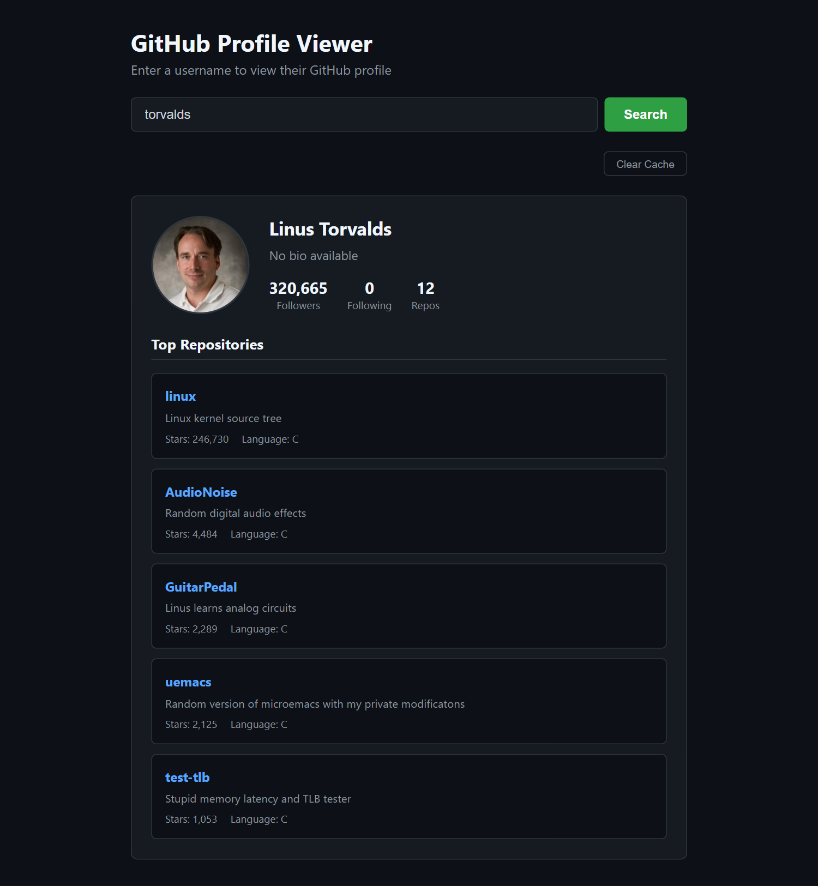
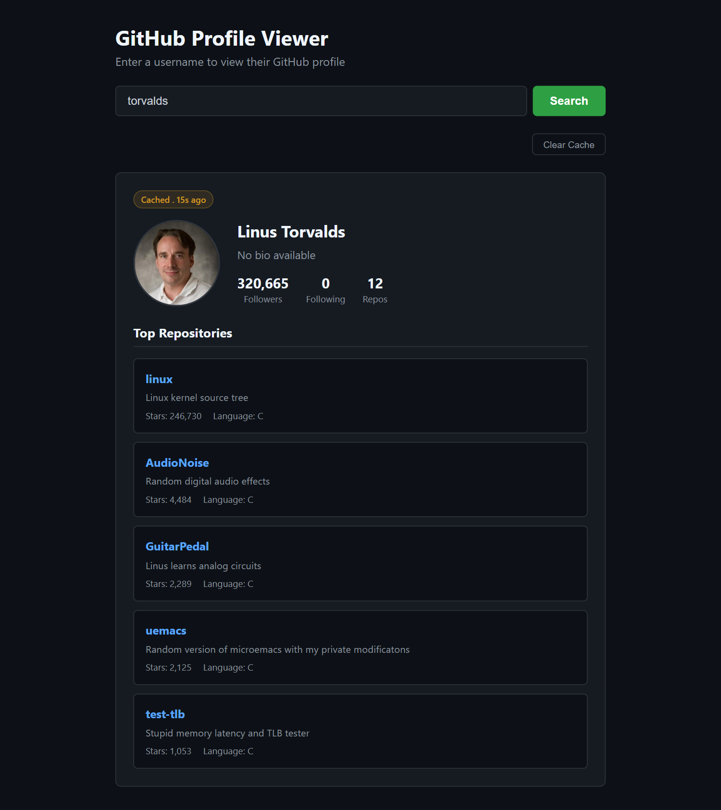
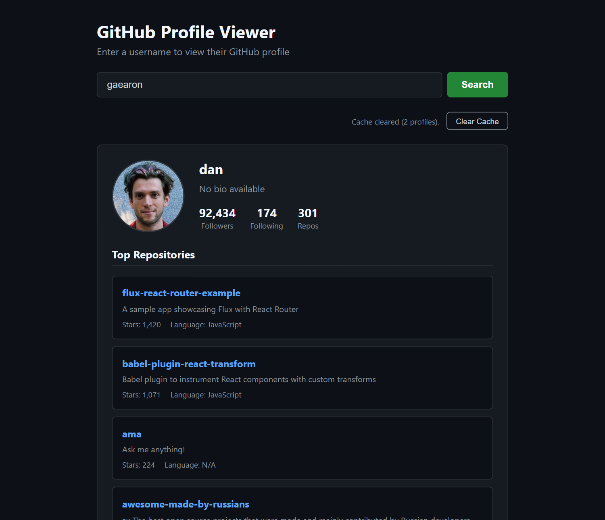
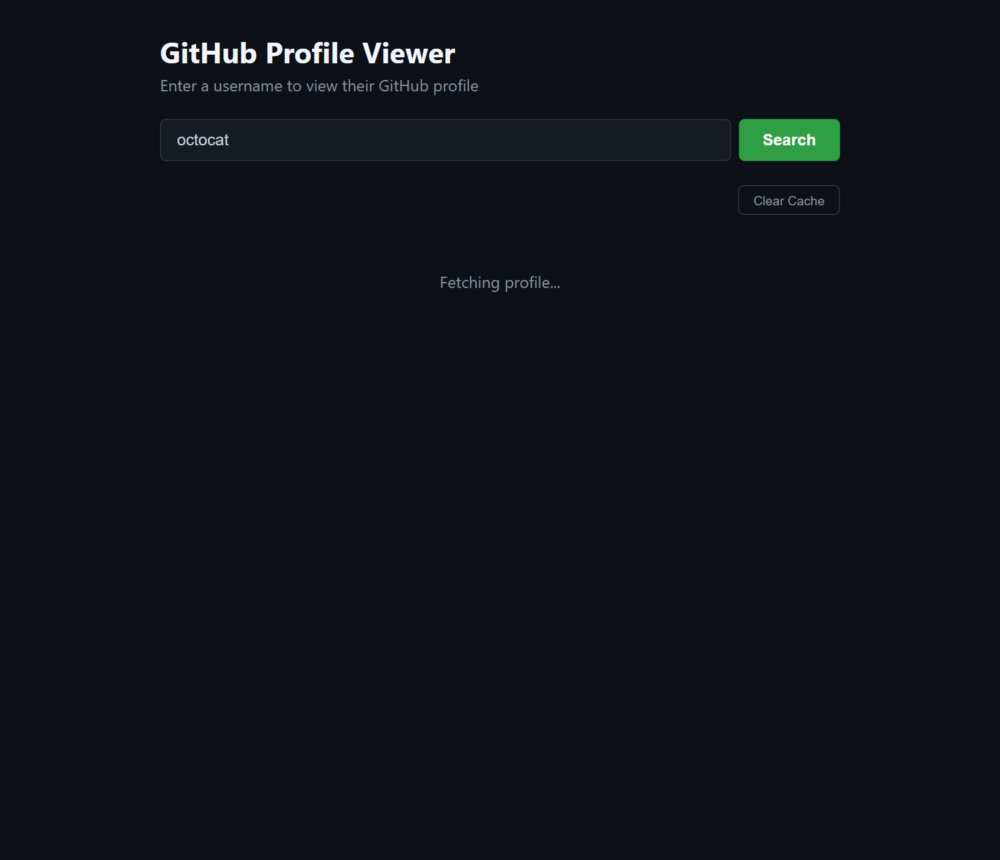
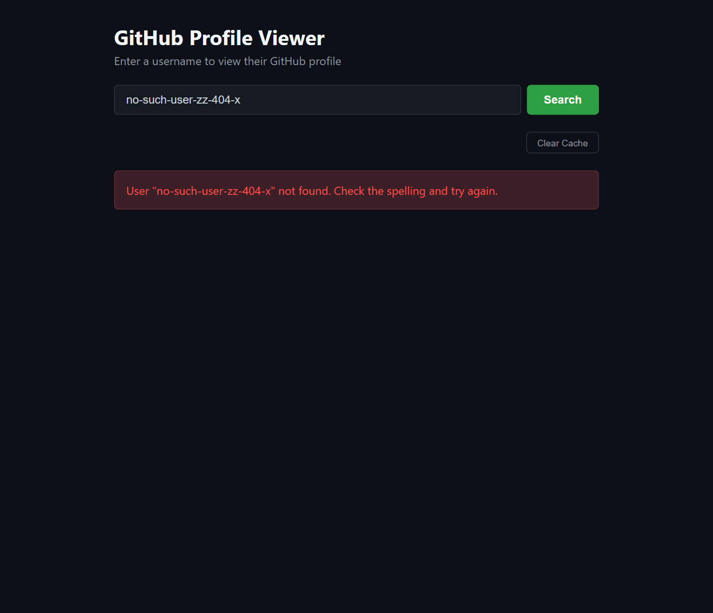
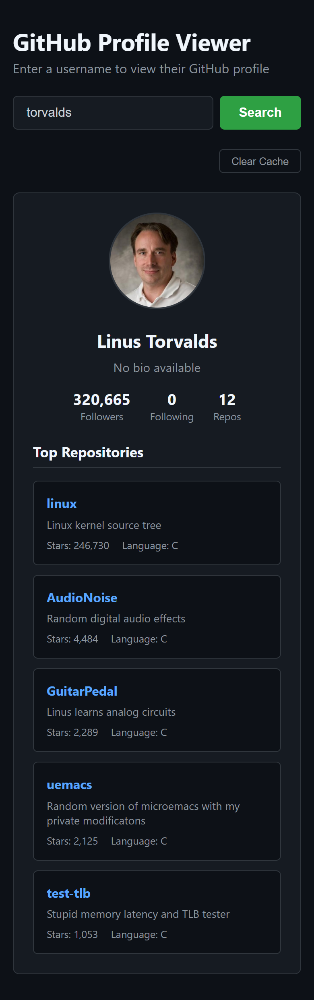

# 🐙 GitHub Profile Viewer

A lightweight, dependency-free GitHub profile lookup tool. Type a username, and the app fetches the user's public profile and top five starred repositories from the [GitHub REST API](https://docs.github.com/en/rest), then caches the result in `localStorage` for five minutes so repeat searches are instant and do not spend API quota.


---

## Table of Contents

- [Screenshots](#screenshots)
- [Features](#features)
- [Tech Stack](#tech-stack)
- [Project Structure](#project-structure)
- [Getting Started](#getting-started)
- [Configuration](#configuration)
- [How It Works](#how-it-works)
- [Caching](#caching)
- [Error Handling](#error-handling)
- [Deployment](#deployment)
- [Known Limitations](#known-limitations)
- [Acknowledgements](#acknowledgements)
- [Author](#author)
- [License](#license)

---

## Screenshots

### Profile view (live fetch)

Avatar, display name, bio, follower and repository counts, and the five most-starred public repositories.



### Cached profile

Searching the same user again within five minutes serves the result from `localStorage`. A yellow **Cached** badge shows how long ago the data was stored, and no network request is made.



### Clear Cache

The **Clear Cache** button removes every stored profile and shows a short confirmation with the count.



### Loading state

A message appears while the two API requests are in flight.



### Error state

Unknown users and rate limits are translated into plain-language messages instead of a blank page.



### Mobile layout

Below 500px the profile header stacks vertically and the stats are centered.



---

## Features

- **Profile lookup** by username, triggered by the Search button or the Enter key.
- **Parallel requests**: the profile and repository endpoints are fetched together with `Promise.all`, so the page renders as soon as both arrive.
- **Top five repositories** sorted by star count, each with a link, description, star total, and primary language.
- **Five-minute `localStorage` cache** keyed by username. Fresh entries skip the network entirely; stale entries are evicted on read and replaced by a new fetch.
- **Cached indicator** on the profile card showing how old the cached data is.
- **Clear Cache button** that removes only this app's entries, reports how many were removed, and drops the badge from the profile on screen.
- **Loading state** while requests are pending.
- **Graceful error handling** for unknown users, rate limits, and other HTTP failures.
- **Safe rendering**: every value from the API is inserted with `textContent`, never `innerHTML`, so untrusted bio or description text cannot inject markup.
- **Responsive layout** that stacks the header on small screens.
- **Zero dependencies**: no framework, no build step, no package manager. Open the HTML file and it runs.

---

## Tech Stack

| Layer | Technology |
| --- | --- |
| Markup | Semantic HTML5 |
| Styling | Modern CSS: Flexbox, GitHub-inspired dark palette, media queries |
| Logic | Vanilla JavaScript (ES2022): `fetch`, `async/await`, `Promise.all`, `localStorage`, `JSON` |
| Data | [GitHub REST API](https://docs.github.com/en/rest): `/users/{username}` and `/users/{username}/repos` |
| Fonts | System font stack (no external font requests) |

---

## Project Structure

```
GitHub-Profile-Viewer/
├── index.html          # Page shell, search box, cache bar, status areas, profile container
├── styles.css          # Layout, components, cache badge and button styles, responsive rules
├── script.js           # Application logic: caching, fetching, rendering, event handling
├── screenshots/        # Images used in this README
│   ├── profile-live.png
│   ├── profile-cached.png
│   ├── clear-cache.png
│   ├── loading-state.png
│   ├── error-state.png
│   └── mobile.png
└── README.md
```

---

## Getting Started

### Prerequisites

- A modern browser (Chrome, Edge, Firefox, or Safari released in the last two years).
- No API key is required. The GitHub REST API allows 60 unauthenticated requests per hour per IP address.
- Optional: any static file server for local development. Examples below use Node.js or Python, but neither is required.

### 1. Clone the repository

```bash
git clone https://github.com/amokim/mctaba.git
cd "mctaba/Week 3/week-3-day-3-assignment/GitHub-Profile-Viewer"
```

### 2. Run the app

**Option A: open the file directly**

Double-click `index.html`. The GitHub API permits cross-origin requests, so the app works from a `file://` URL. Note that `localStorage` on a `file://` origin is shared across every local HTML file you open, which is harmless here because all cache keys carry the `ghProfile:` prefix.

**Option B: serve it locally (recommended)**

Serving over HTTP matches how the app behaves once deployed and gives the cache its own origin.

```bash
# Node.js
npx serve .

# Python 3
python -m http.server 8000

# VS Code
# Install the "Live Server" extension, right-click index.html, choose "Open with Live Server"
```

Then visit the URL printed in your terminal, for example `http://localhost:3000` or `http://localhost:8000`.

### 3. Verify it works

1. Search for `torvalds`. The loading message appears briefly, then the profile renders with no badge.
2. Search for `torvalds` again. The profile appears instantly with a **Cached** badge, and the Network tab in DevTools shows no new request.
3. Click **Clear Cache**. The badge disappears and the status reads "Cache cleared (1 profile)."
4. Search once more. The app fetches fresh data.

---

## Configuration

All tunable values live at the top of `script.js`.

| Constant | Default | Purpose |
| --- | --- | --- |
| `CACHE_PREFIX` | `"ghProfile:"` | Prefix for every `localStorage` key. Lets **Clear Cache** remove only this app's data. |
| `CACHE_TTL_MS` | `5 * 60 * 1000` | How long a cached profile stays fresh, in milliseconds. Default is five minutes. |

Two other values are set inline in `fetchProfile`:

- `per_page=100` on the repositories request controls how many repos are fetched before sorting. Users with more than 100 public repos may have a highly starred repo on a later page.
- `.slice(0, 5)` controls how many repositories are displayed.

---

## How It Works

1. **Input.** Clicking Search or pressing Enter trims the input and calls `fetchProfile`. Empty input is ignored.
2. **Cache check.** `getCachedProfile` reads `localStorage` for the lowercased username. If an entry exists, is well-formed, and is younger than the TTL, it is returned and rendered immediately. Otherwise it is removed and `null` comes back.
3. **Fetch.** Two requests are issued in parallel: the user profile and the first 100 public repositories. The loading message is shown while they are pending.
4. **Validate.** If the profile response is not `ok`, the status code is mapped to a user-facing message and thrown. A failed repository response is reported separately.
5. **Sort and store.** Repositories are sorted by `stargazers_count` descending and trimmed to five. The profile, the five repos, and a `Date.now()` timestamp are written to `localStorage` by `setCachedProfile`.
6. **Render.** `displayProfile` clears the container and builds the header, stats, and repo cards with `document.createElement` and `textContent`. When a cache timestamp is passed in, it prepends the **Cached** badge.

---

## Caching

The cache is a thin layer over `localStorage`. Each entry is a JSON object stored under one key per username:

```
Key:   ghProfile:torvalds
Value: { "profile": { ... }, "repos": [ ... ], "timestamp": 1757100000000 }
```

| Situation | Behaviour |
| --- | --- |
| No entry for the username | Fetch from the API, then store the result. |
| Entry younger than 5 minutes | Render from cache, show the **Cached** badge, make no request. |
| Entry older than 5 minutes | Delete it, fetch fresh data, store the new result. |
| Entry is malformed or not valid JSON | Delete it and fetch as if it were missing. |
| `localStorage` is full or blocked | Silently skip caching. The app still works, every search just hits the API. |
| **Clear Cache** clicked | Remove every key starting with `ghProfile:`, report the count, and remove the badge from the profile on screen. |

Usernames are lowercased before building the key, so `Torvalds` and `torvalds` share one entry. GitHub usernames are case-insensitive, so this never returns the wrong user.

To test expiry without waiting five minutes, paste this into the browser console after searching for a user, then search again:

```js
const key = 'ghProfile:torvalds';
const entry = JSON.parse(localStorage.getItem(key));
entry.timestamp -= 6 * 60 * 1000;
localStorage.setItem(key, JSON.stringify(entry));
```

---

## Error Handling

| Condition | What the user sees |
| --- | --- |
| `404 Not Found` on the profile request | User "*name*" not found. Check the spelling and try again. |
| `403 Forbidden` on the profile request | API rate limit exceeded. Wait a minute and try again. |
| Any other non-2xx status on the profile request | Github API error: *status* |
| Non-2xx status on the repositories request | Could not load repositories (error *status*). |
| Offline / DNS failure | The browser's own `TypeError` message, for example "Failed to fetch". |
| User with zero public repositories | The profile renders normally with "No public repositories" under the heading. |

Cached data is never shown for a failed request, and a failed request never overwrites a cached entry.

---

## Deployment

The project is static, so any static host works. No build step is required.

### GitHub Pages

1. Push the repository to GitHub.
2. In the repository, open **Settings → Pages**.
3. Under **Build and deployment**, set **Source** to *Deploy from a branch*, choose the `main` branch and the `/ (root)` folder, then save.
4. After the workflow finishes, the app is served from the folder path inside the repo:

   ```
   https://amokim.github.io/mctaba/Week%203/week-3-day-3-assignment/GitHub-Profile-Viewer/
   ```

   Because this project lives in a subfolder of a larger repository, the URL includes the full path. Moving the three source files to the repository root would shorten it to `https://amokim.github.io/mctaba/`.

### Netlify

Drag the `GitHub-Profile-Viewer` folder onto the [Netlify Drop](https://app.netlify.com/drop) page. A public URL is issued in a few seconds. For continuous deployment, connect the GitHub repository and set the **Base directory** to `Week 3/week-3-day-3-assignment/GitHub-Profile-Viewer` with an empty build command.

### Vercel

```bash
npm i -g vercel
cd "Week 3/week-3-day-3-assignment/GitHub-Profile-Viewer"
vercel
```

Accept the defaults when prompted. Vercel detects the project as static and serves `index.html`.

---

## Known Limitations

- **Unauthenticated rate limit.** GitHub allows 60 unauthenticated requests per hour per IP. Each fresh search costs two requests, so roughly 30 new profiles per hour. The cache reduces this for repeat searches, but a personal access token sent in an `Authorization` header would raise the limit to 5,000.
- **Top repos only from the first 100.** The repositories request fetches one page of 100. A user with more public repos could have a highly starred one that never gets considered.
- **Cache is per browser, per origin.** Cached profiles are not shared between devices or browsers, and a private window starts empty.
- **No storage quota management.** Each entry is small, but there is no eviction of old entries beyond the TTL check on read. Searching hundreds of distinct users over time leaves stale entries in `localStorage` until they are searched again or **Clear Cache** is clicked.
- **No request cancellation.** Searching two users in quick succession on a slow connection can let the earlier response render after the later one. An `AbortController` would close this race.
- **Age label is static.** The "Cached . 15s ago" text is computed once at render time and does not tick.

---

## Acknowledgements

- Profile and repository data provided by the [GitHub REST API](https://docs.github.com/en/rest).
- Colour palette inspired by GitHub's dark theme.
- Built as the Week 3, Day 3 assignment for the MCTABA program.

---

## Author

**amo**
GitHub: [@amokim](https://github.com/amokim)

---

## License

This project is released under the [MIT License](https://opensource.org/licenses/MIT). You are free to use, modify, and distribute it with attribution.
