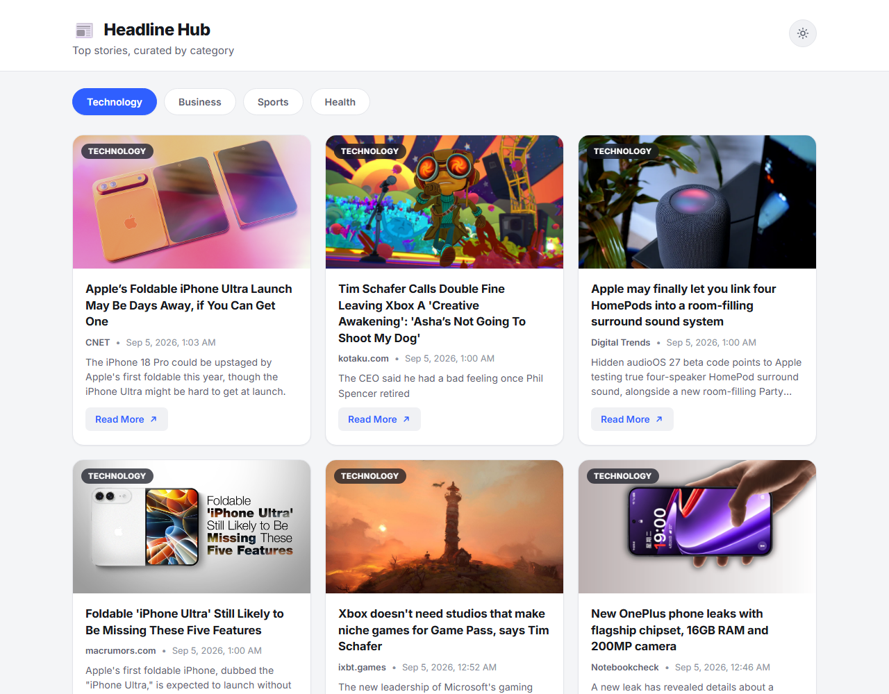
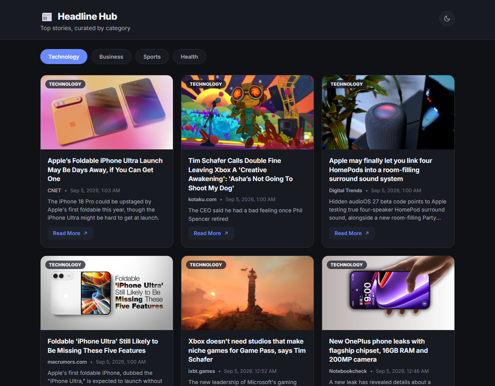
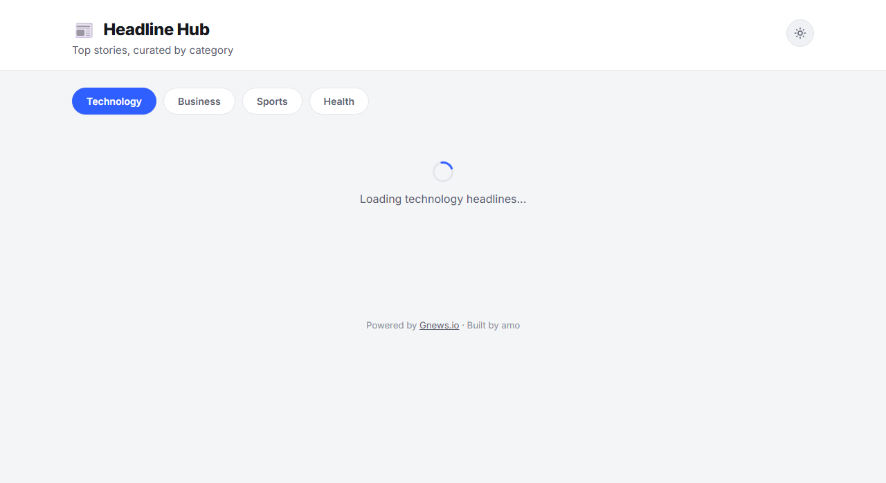
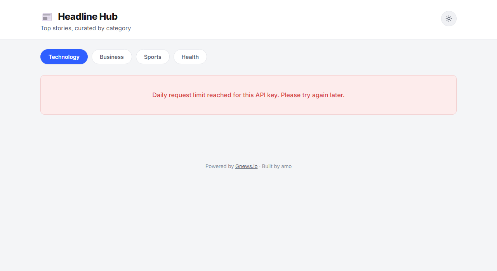
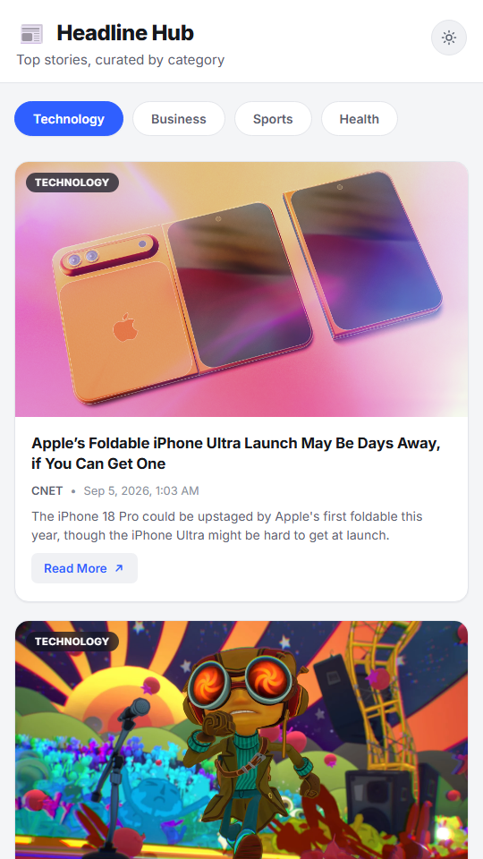

# 📰 Headline Hub

A lightweight, dependency-free news headline aggregator. Headline Hub pulls the ten latest top stories from the [GNews API](https://gnews.io) and presents them in a responsive card grid with category filtering, light/dark theming, and graceful loading and error states.


---

## Table of Contents

- [Screenshots](#screenshots)
- [Features](#features)
- [Tech Stack](#tech-stack)
- [Project Structure](#project-structure)
- [Getting Started](#getting-started)
- [Configuration](#configuration)
- [How It Works](#how-it-works)
- [Error Handling](#error-handling)
- [Deployment](#deployment)
- [Known Limitations](#known-limitations)
- [Acknowledgements](#acknowledgements)
- [Author](#author)
- [License](#license)

---

## Screenshots

### Light theme (default view)

Ten technology headlines in a three-column card grid. Each card shows the article image, category badge, title, source, formatted publish date, description, and a Read More link.



### Dark theme

Toggled with the sun/moon button in the header. The choice is remembered across visits.



### Loading state

A spinner and message appear while the API request is in flight.



### Error state

API failures are translated into a plain-language message instead of a blank page. This example shows the response to a rate-limit error.



### Mobile layout

Below 560px the grid collapses to a single column and the filter buttons wrap.



---

## Features

- **Ten curated headlines** per category, rendered from a reusable HTML `<template>`.
- **Category filter** for Technology, Business, Sports, and Health. Clicking a pill refetches and re-renders without a page reload.
- **Rich cards**: image, uppercase category badge, title, source name, human-readable publish date, three-line clamped description, and a Read More link that opens in a new tab with `rel="noopener noreferrer"`.
- **Loading state** with an animated spinner while the request is pending.
- **Graceful error handling** that maps HTTP status codes to friendly messages and distinguishes network failures from API errors.
- **Empty state** when a category returns no articles.
- **Light / dark theme toggle** that persists to `localStorage` and falls back to the operating system preference on first visit.
- **Responsive grid** using CSS Grid `auto-fill`, with a single-column layout on small screens and a centered orphan card on the last row at desktop widths.
- **Accessible by default**: `aria-live` region for results, `aria-pressed` on toggle buttons, descriptive `aria-label`s on links, and semantic landmarks.
- **Zero dependencies**: no framework, no build step, no package manager. Open the HTML file and it runs.

---

## Tech Stack

| Layer | Technology |
| --- | --- |
| Markup | Semantic HTML5 with a `<template>` element for card rendering |
| Styling | Modern CSS: custom properties, Grid, Flexbox, `prefers-color-scheme`, `aspect-ratio`, `line-clamp` |
| Logic | Vanilla JavaScript (ES2022): `fetch`, `async/await`, `URLSearchParams`, `Intl.DateTimeFormat` |
| Data | [GNews API v4](https://gnews.io/docs/v4) `top-headlines` endpoint |
| Fonts | [Inter](https://fonts.google.com/specimen/Inter) via Google Fonts |

---

## Project Structure

```
New-Headline-Aggregator/
├── index.html          # Page shell, category nav, status area, card template
├── styles.css          # Design tokens, layout, components, dark mode, responsive rules
├── script.js           # Application logic: fetching, rendering, filtering, theming
├── test.js             # Reference implementation used during development
├── screenshots/        # Images used in this README
│   ├── light-technology.png
│   ├── dark-technology.png
│   ├── loading-state.png
│   ├── error-state.png
│   └── mobile-light.png
└── README.md
```

---

## Getting Started

### Prerequisites

- A modern browser (Chrome, Edge, Firefox, or Safari released in the last two years).
- A free [GNews API key](https://gnews.io/register). The free tier allows 100 requests per day.
- Optional: any static file server for local development. Examples below use Node.js or Python, but neither is required.

### 1. Clone the repository

```bash
git clone https://github.com/amokim/mctaba.git
cd "mctaba/Week 3/week-3-day-3-assignment/New-Headline-Aggregator"
```

### 2. Add your API key

Open `script.js` and replace the value of `NEWS_API_KEY` near the top of the file:

```js
const NEWS_API_KEY = "your-gnews-api-key-here";
```

### 3. Run the app

**Option A: open the file directly**

Double-click `index.html`. GNews permits cross-origin requests, so the app works from a `file://` URL.

**Option B: serve it locally (recommended)**

Serving over HTTP matches how the app behaves once deployed and avoids browser quirks with `file://` origins.

```bash
# Node.js
npx serve .

# Python 3
python -m http.server 8000

# VS Code
# Install the "Live Server" extension, right-click index.html, choose "Open with Live Server"
```

Then visit the URL printed in your terminal, for example `http://localhost:3000` or `http://localhost:8000`.

### 4. Verify it works

You should see ten Technology headlines within a second or two. Click another category and watch the grid refresh. Open DevTools and check the Network tab to see exactly one request per category click.

---

## Configuration

All tunable values live at the top of `script.js`.

| Constant | Default | Purpose |
| --- | --- | --- |
| `NEWS_API_KEY` | *(set your own)* | Your GNews API key. Required. |
| `API_BASE` | `https://gnews.io/api/v4/top-headlines` | Endpoint used for every request. |
| `ARTICLE_COUNT` | `10` | Number of headlines to display. The free GNews tier caps this at 10. |
| `DEFAULT_CATEGORY` | `"technology"` | Category loaded on first paint. Must match a `data-category` value in `index.html`. |

To add a category, add a button to the `#categoryFilter` nav in `index.html` with a `data-category` attribute matching one of GNews's supported values: `general`, `world`, `nation`, `business`, `technology`, `entertainment`, `sports`, `science`, or `health`. No JavaScript changes are needed.

---

## How It Works

1. **Boot.** On load, the script reads the saved theme from `localStorage`, applies it, highlights the default category pill, and requests that category.
2. **Fetch.** A request is sent to GNews with the category, `lang=en`, and the API key as query parameters. While the promise is pending, the status area shows the loading spinner.
3. **Validate.** If `response.ok` is false, the status code is mapped to a user-facing message and thrown. Network-level failures surface as a `TypeError` and get their own connectivity message.
4. **Render.** For each article, the `<template>` is cloned, its fields are populated with `textContent` (never `innerHTML`, so API content cannot inject markup), and the card is appended to the grid. The publish timestamp is formatted with `Intl.DateTimeFormat`.
5. **Filter.** A single delegated click listener on the category nav reads `data-category` from the clicked pill, updates the active state, clears the grid, and repeats from step 2. Clicking the already-active pill is a no-op so it does not spend an API request.

---

## Error Handling

| Condition | What the user sees |
| --- | --- |
| `400 Bad Request` | The request was invalid. Please try a different category. |
| `401 Unauthorized` | The API key is missing or invalid. |
| `403 Forbidden` | Daily request limit reached for this API key. Please try again later. |
| `429 Too Many Requests` | Too many requests. Please wait a moment and try again. |
| `503 Service Unavailable` | The news service is temporarily unavailable. Please try again shortly. |
| Any other non-2xx status | Something went wrong while fetching headlines. Please try again. |
| Offline / DNS failure / CORS block | Unable to reach the news service. Check your internet connection and try again. |
| Successful response with zero articles | No *category* headlines found right now. Try another category. |

All failures are also logged to the console with the original error object for debugging.

---

## Deployment

The project is static, so any static host works. No build step is required.

### GitHub Pages

1. Push the repository to GitHub.
2. In the repository, open **Settings → Pages**.
3. Under **Build and deployment**, set **Source** to *Deploy from a branch*, choose the `main` branch and the `/ (root)` folder, then save.
4. After the workflow finishes, the app is served from the folder path inside the repo:

   ```
   https://amokim.github.io/mctaba/Week%203/week-3-day-3-assignment/New-Headline-Aggregator/
   ```

   Because this project lives in a subfolder of a larger repository, the URL includes the full path. Moving the three source files to the repository root would shorten it to `https://amokim.github.io/mctaba/`.

### Netlify

Drag the `New-Headline-Aggregator` folder onto the [Netlify Drop](https://app.netlify.com/drop) page. A public URL is issued in a few seconds. For continuous deployment, connect the GitHub repository and set the **Base directory** to `Week 3/week-3-day-3-assignment/New-Headline-Aggregator` with an empty build command.

### Vercel

```bash
npm i -g vercel
cd "Week 3/week-3-day-3-assignment/New-Headline-Aggregator"
vercel
```

Accept the defaults when prompted. Vercel detects the project as static and serves `index.html`.

### Before you deploy

Remember that the API key is shipped to the browser in plain text (see [Known Limitations](#known-limitations)). For a public deployment, restrict the key in your GNews dashboard where possible, or proxy requests through a serverless function that holds the key server-side.

---

## Known Limitations

- **Client-side API key.** The key is embedded in `script.js` and visible to anyone who opens DevTools. This is acceptable for a learning project on a free tier but should not be done with a paid key. The fix is a small backend proxy (Cloudflare Worker, Netlify Function, or similar) that appends the key.
- **Rate limits.** The free GNews plan allows 100 requests per day and up to 10 articles per request. Every category click costs one request. Heavy use will produce the 403 message shown above until the quota resets.
- **No caching.** Switching back to a category you already viewed refetches it. An in-memory cache keyed by category would remove redundant requests.
- **No request cancellation.** If you click two categories quickly on a slow connection, the earlier response can land after the later one. An `AbortController` that cancels the in-flight request would close this race.
- **English only.** The request hardcodes `lang=en`. GNews supports other languages via the `lang` and `country` parameters.
- **Missing images.** Articles without an `image` field render a broken image icon. A placeholder or hiding the image wrapper would be a cleaner fallback.

---

## Acknowledgements

- News data provided by [GNews](https://gnews.io).
- Typeface: [Inter](https://rsms.me/inter/) by Rasmus Andersson.
- Built as the Week 3, Day 3 assignment for the MCTABA program.

---

## Author

**amo**
GitHub: [@amokim](https://github.com/amokim)

---

## License

This project is released under the [MIT License](https://opensource.org/licenses/MIT). You are free to use, modify, and distribute it with attribution.
