# Week 3 Day 4 – Git Branching, Merging, Conflict Resolution and Pull Requests

A small Peugeot landing page (`index.html` + `styles.css`) built commit by commit to practise the core Git workflow: making a series of commits on `main`, developing a feature on its own branch, merging it back, deliberately creating and resolving a merge conflict, and finally opening a pull request on GitHub.

All screenshots referenced below live in the `screenshots/` folder.

## Task 1 – Branching and Merging

### Commits on `main`

Five commits were made on `main` to build the page up in stages.

| # | Commit message | Hash | Screenshot |
| --- | --- | --- | --- |
| 1 | Add `index.html` with basic structure | `5e43d2c` | 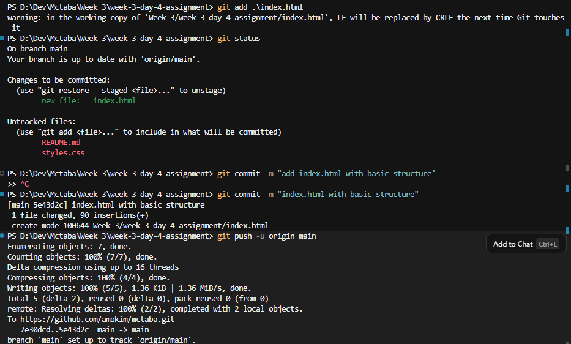 |
| 2 | Add `styles.css` with body styles | `63ce933` | 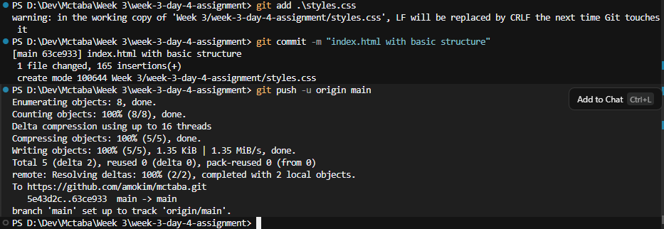 |
| 3 | Add a header section to HTML | `b8deca1` | 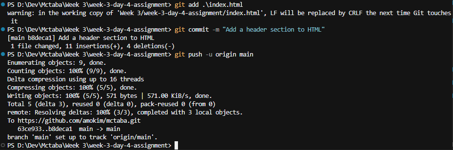 |
| 4 | Add a hero section to HTML | `e0d34b8` | 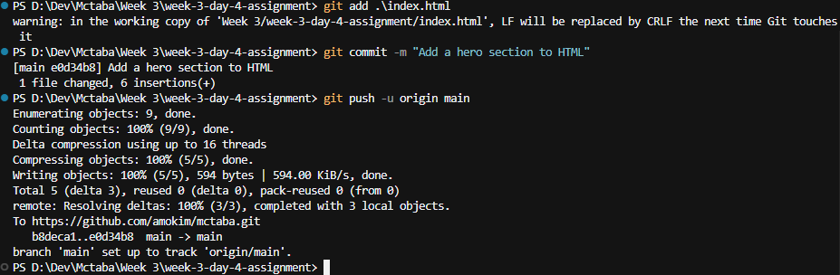 |
| 5 | Style the header and hero in CSS | `2d98014` | 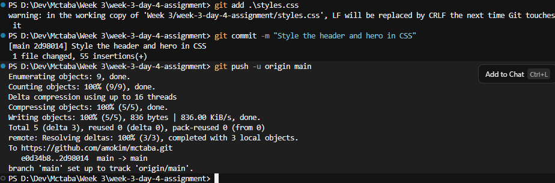 |

> Note: commit 2 was accidentally given the same message as commit 1 ("index.html with basic structure"). It is the commit that adds `styles.css`, as the `create mode ... styles.css` line in the screenshot shows.

### Feature branch `feature/footer`

A new branch was created from `main` and three commits were made on it:

```bash
git checkout -b feature/footer
```

| # | Commit message | Hash | Screenshot |
| --- | --- | --- | --- |
| 6 | Add footer HTML | `05ce1e2` | 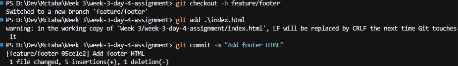 |
| 7 | Style the footer | `dd1228b` | 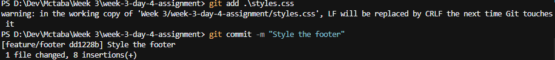 |
| 8 | Add social media links to footer | `6d605f1` | 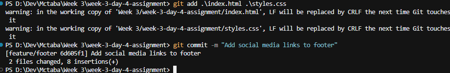 |

### Merging back into `main`

```bash
git checkout main
git merge feature/footer
```

Because `main` had not moved since the branch was created, Git performed a **fast-forward merge**: `main` was simply moved up to point at the same commit as `feature/footer`, so no separate merge commit was needed.

### Full history

```bash
git log --oneline --graph --all
```


The graph shows all eight commits in order, with `HEAD -> main` and `feature/footer` both pointing at the final "Add social media links to footer" commit, and `origin/main` still at commit 5 (the feature branch had not been pushed yet).

## Task 2 – Merge Conflict Resolution

### Creating the two branches

From `main`, two branches were created that each change the **same line** of `styles.css` (the `--bg` custom property in `:root`) to a different value.

```bash
# Branch 1: light background
git checkout -b feature/nav-v1
# edit styles.css -> --bg: #f0f0f0;
git add styles.css
git commit -m "Update background to #f0f0f0"

# Branch 2: dark background
git checkout main
git checkout -b feature/nav-v2
# edit styles.css -> --bg: #1a1a2e;
git add styles.css
git commit -m "Update background to #1a1a2e"
```

### Merging

```bash
git checkout main
git merge feature/nav-v1   # succeeds (fast-forward)
git merge feature/nav-v2   # CONFLICT (content): Merge conflict in styles.css
```

The first merge went through cleanly. The second failed because both branches had edited the same line since they diverged, and Git cannot decide which value to keep.

### 1. The conflict markers

Opening `styles.css` showed the conflict block. `HEAD` (the current state of `main`, which now contains `feature/nav-v1`) wanted `#f0f0f0`, while the incoming `feature/nav-v2` wanted `#1a1a2e`.

```text
<<<<<<< HEAD
  --bg: #f0f0f0;
=======
  --bg: #1a1a2e;
>>>>>>> feature/nav-v2
```

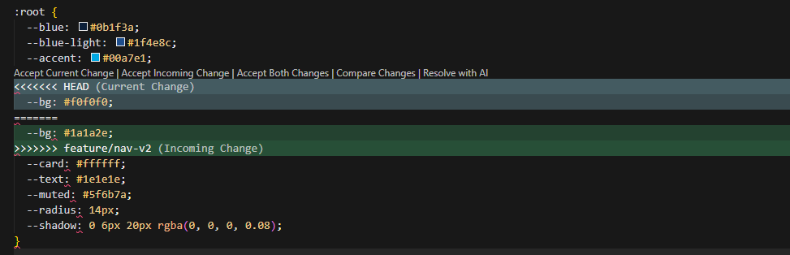

### 2. The resolution

The dark value `#1a1a2e` from `feature/nav-v2` was kept and the three marker lines were deleted, leaving a clean `:root` block.

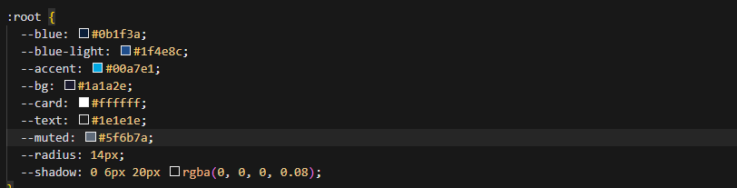

The resolution was then staged and committed:

```bash
git add styles.css
git commit -m "Update background to #1a1a2e"
```

### 3. The final commit graph

```bash
git log --oneline --graph
```

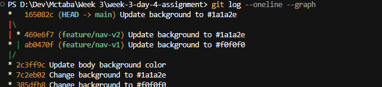

The graph shows the two branches diverging from `main`, `feature/nav-v1` (`ab0470f`) and `feature/nav-v2` (`469e6f7`) side by side, and the merge commit `165082c` on `main` joining them back together.

> Note: the three commits directly below the fork ("Change background to #f0f0f0", "Change background to #1a1a2e", "Update body background color") were a first attempt at this task made directly on `main`. They were superseded by the branch-based attempt above, which is the one that produced the conflict.

## Task 3 – Collaborative Workflow (Pull Request)

The pull request workflow was practised on the public repository [amokim/alx-zero_day](https://github.com/amokim/alx-zero_day), a small ALX starter repo containing a `0x03-git/bash/alx` shell script. The clone lives in `alx-zero_day/` inside this folder.

### Step 1 – Clone the repository

```bash
git clone https://github.com/amokim/alx-zero_day
```

```text
Cloning into 'alx-zero_day'...
remote: Enumerating objects: 36, done.
remote: Counting objects: 100% (36/36), done.
remote: Compressing objects: 100% (22/22), done.
remote: Total 36 (delta 3), reused 31 (delta 1), pack-reused 0 (from 0)
Receiving objects: 100% (36/36), done.
Resolving deltas: 100% (3/3), done.
```

The file to change is inside `0x03-git/bash/`, which holds two small scripts, `alx` and `school`:

```bash
cd alx-zero_day/0x03-git/bash
ls
```

### Step 2 – Create a feature branch

```bash
git checkout -b feature/add-5-echo-statements
# Switched to a new branch 'feature/add-5-echo-statements'
```

### Step 3 – Make a meaningful change

Five `echo` statements were added to the `alx` script so that running it prints a short set of messages:

```bash
echo "I love coding!"
echo "Coding is so intuitive!"
echo "Coding is awesome!"
echo "Lets solve real-world problems with code!"
echo ":)!"
```

### Step 4 – Commit with a clear message

```bash
git add ./alx
git commit -m "add 5-echo-statements"
# [feature/add-5-echo-statements 521abe0] add 5-echo-statements
#  1 file changed, 5 insertions(+)
```

### Step 5 – Push the branch to GitHub

```bash
git push -u origin feature/add-5-echo-statements
```

```text
Enumerating objects: 9, done.
Counting objects: 100% (9/9), done.
Delta compression using up to 16 threads
Compressing objects: 100% (5/5), done.
Writing objects: 100% (5/5), 605 bytes | 605.00 KiB/s, done.
Total 5 (delta 0), reused 0 (delta 0), pack-reused 0 (from 0)
remote:
remote: Create a pull request for 'feature/add-5-echo-statements' on GitHub by visiting:
remote:      https://github.com/amokim/alx-zero_day/pull/new/feature/add-5-echo-statements
remote:
To https://github.com/amokim/alx-zero_day
 * [new branch]      feature/add-5-echo-statements -> feature/add-5-echo-statements
branch 'feature/add-5-echo-statements' set up to track 'origin/feature/add-5-echo-statements'.
```

Git itself prints a link to open a pull request for the new branch. After the push, GitHub shows a banner on the repository home page offering to open a pull request for the new branch.


### Step 6 – Open the pull request

Clicking **Compare & pull request** opens the PR form. The PR compares `feature/add-5-echo-statements` against `main`, and GitHub confirms the branches can be merged automatically. A title and a description were added before clicking **Create pull request**.

| Field | Value |
| --- | --- |
| Base | `main` |
| Compare | `feature/add-5-echo-statements` |
| Title | `add 5-echo-statements` |
| Description | `Added 5 echo statements` |


### Step 7 – The open pull request

The submitted pull request (#1) shows the title, the description, the single commit, and the **Files changed (1)** tab with `+5` additions. GitHub reports no conflicts with the base branch, so it is ready to merge.


> Notes: the assignment suggests the branch name `feature/your-name-contribution`; the branch here was named after the change instead (`feature/add-5-echo-statements`). The change is a script edit rather than a visual one, so no UI screenshot was attached to the PR itself.

## Commands used

| Command | Purpose |
| --- | --- |
| `git init` / `git clone` | Start or copy a repository |
| `git add <file>` | Stage changes |
| `git commit -m "<message>"` | Record staged changes |
| `git checkout -b <branch>` | Create and switch to a new branch |
| `git checkout <branch>` | Switch to an existing branch |
| `git merge <branch>` | Merge a branch into the current one |
| `git log --oneline --graph --all` | View compact history as a graph across all branches |
| `git push -u origin <branch>` | Push a branch and set its upstream |

## Project structure

```
week-3-day-4-assignment/
├── index.html        # Landing page: header, hero, models, footer with social links
├── styles.css        # Page styles; the --bg variable is the line used for the conflict
├── alx-zero_day/     # Clone of amokim/alx-zero_day used for the pull request task
├── screenshots/      # Evidence for all three tasks
│   ├── Commit1.png … Commit8.png
│   ├── GitLog for Task1.png
│   ├── merge-conflict.png
│   ├── resolve-conflict.png
│   ├── commit-conflict-resolution.png
│   ├── viewinng pull request.png
│   ├── Pull request.png
│   └── submitted pull request.png
└── README.md
```
